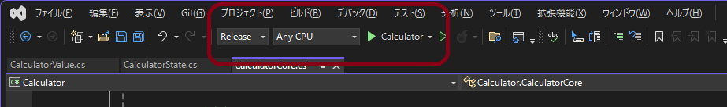
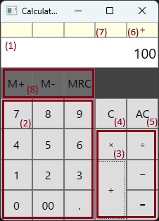
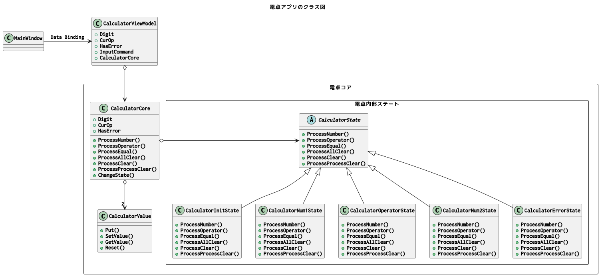

電卓アプリケーション
===============

## 概要
WPF(Windows Media Foundation)を用いた電卓アプリです。

## 使用環境

使用環境は下記のとおりです。

 * Windows 11
 * Microsoft Visual Studio Community 2022 (64 ビット), Version Version 17.8.6
 * .NET 8.0
 * WPF

## 起動方法

起動方法は下記の通りです.

 1. 下記のGitリポジトリをクローンして下さい.
    * リポジトリ: https://github.com/peregrine-a/Calculator.git
    * ブランチ: master
    
 2. リポジトリ直下の"Calculator.sln"をVisual Studioでオープンして下さい.

 3. ビルドして実行してください.
    

## UI・動作仕様

### UI仕様
UIは下図の通りです.

 | 番号  | 説明                                                                            |
 | :--- | :----------------------------------------------------------------------------- |
 | (1)  | 入力中の数値, および計算結果を表示するディスプレイです.                                     |
 | (2)  | 電卓の数値ボタン群です.                                                              |
 | (3)  | 演算子およびイコールボタンです.                                                        |
 | (4)  | Clearボタンです. 現在入力中の数値をクリアします.                                         |
 | (5)  | All Clearボタンです. 計算をリセットして初期状態に戻ります.                                 |
 | (6)  | 現在選択中の演算子表です. "＋", "－", "×", "÷"のいずれかが表示されます.                    |
 | (7)  | 計算エラー発生時に"E"と表示されます. ClearまたはAll Clearボタンを押すことで解除されます.        |
 | (8)  | M+, M-, MRCボタンです. 現状未実装です.                                               |

### 対応機能
対応機能は下記の通りです.

 * 四則演算
 * 入力数値および計算結果の表示機能
 * 現在選択中の四則演算の表示機能
 * エラーステータスの表示機能(オーバーフロー, ゼロ除算)
 * A (Clear)機能
 * AC (All Clear)機能

### 未対応機能

現状の実装では, 下記の機能には未対応です.

 * M+ボタン機能(ボタンは配置してあるが動作しない)
 * M-ボタン機能(ボタンは配置してあるが動作しない)
 * MRCボタン機能(ボタンは配置してあるが動作しない)

### 動作仕様

* ディスプレイの初期表示は0です.
* ディスプレイは空欄になることはありません.
* ディスプレイの最大桁数は符号と小数点を含めて20桁です.
* ディスプレイは右詰です.
* 20桁を超えた時の数値入力は無視されます.
* "."ボタンを押すと, "."が右端に表示され, それ以降に入力される数値は小数部分となります.

* 1個目の数値が入力された状態で, "＋"ボタンを押し, その後2個目の数値を入力し, 最後にイコールボタンを押すと,
  2つの数値の加算結果がディスプレイに表示されます.
* 1個目の数値が入力された状態で, "ー"ボタンを押し, その後2個目の数値を入力し, 最後にイコールボタンを押すと,
  2つの数値の減算結果がディスプレイに表示されます.
* 1個目の数値が入力された状態で, "×"ボタンを押し, その後2個目の数値を入力し, 最後にイコールボタンを押すと,
    2つの数値の乗算結果がディスプレイに表示されます.
* 1個目の数値が入力された状態で, "÷"ボタンを押し, その後2個目の数値を入力し, 最後にイコールボタンを押すと,
  2つの数値の除算結果がディスプレイに表示されます.

* 1個目の数値が入力された状態で, 演算子ボタン("＋", "－", "×", "÷”)を押し, その後2個目の数値を入力し,  
  更に続けて2個目の演算子ボタン("＋", "－", "×", "÷”)を押した場合の動作は下記の通りです.
  1. 2つの数値の計算結果がディスプレイに表示されます.
  2. 計算結果を1個目の入力とし, 直前に押した演算子が選択された状態で, 2個目の数値入力を受け付けます.

* Clearボタン("C")を押すと現在入力中の数値を削除します.
  - 1個目の数値入力中の場合, 1個目の数値入力のやり直しとなります.
  - 2個目の数値入力中の場合, 1個目の数値および演算子入力は保持されたまま, 2個目の数値入力のやり直しとなります.

* ACボタン("AC")を押すと, 初期状態に戻ります.

* 次の場合にエラーが発生します.

  - 演算結果がオーバーフローした場合.
  - 0で除算を行った場合.
  - 計算結果の整数部分が, 符号を含めて20桁を超える場合.

* エラーが発生した場合, ディスプレイ表示に"Error.", ステータス表示に"E"と表示されます.
* エラー状態ではClearボタン("C")またはAll Clearボタン("AC")以外のボタンは受け付けません.
* Clearボタン("C")またはAll Clearボタン("AC")を押すと, 初期状態に戻ります.

## 設計詳細

### ソースファイル一覧

ソースファイルは下記の通りです.

| ソースファイル名                | 概要                                                               |
| :-------------------------- | :---------------------------------------------------------------- |
| MainWindow.xaml.cs          | UI定義                                                             |
| CalculatorViewModel.cs      | 電卓のViewModelを表すクラス                                            |
| CalculatorCommand.cs        | 電卓のボタン押下処理に対応するためのコマンドクラス.                            |
| CalculatorCore.cs           | 電卓機能を実現するコアクラス                                             |
| CalculatorState.cs          | 電卓の内部状態を表現するクラス(ステートパターンのベースクラス)                   |
| CalculatorInitState.cs      | 電卓の内部状態を表現するクラス(ステートパターンのサブクラス, 初期状態)             |
| CalculatorNum1State.cs      | 電卓の内部状態を表現するクラス(ステートパターンのサブクラス, 1個目の数値の入力中状態) |   
| CalculatorNum2State.cs      | 電卓の内部状態を表現するクラス(ステートパターンのサブクラス, 2個目の数値の入力中状態) |   
| CalculatorOperatorState.cs  | 電卓の内部状態を表現するクラス(ステートパターンのサブクラス, 演算子の入力中状態)     |   
| CalculatorErrorState.cs     | 電卓の内部状態を表現するクラス(ステートパターンのサブクラス, エラー状態)           |
| CalculatorTokens.cs         | 電卓のボタンに対応するトークン定義(数値, 小数点, 演算子, イコール等)             |
| CalculatorValue.cs          | 電卓に入力された, または電卓で計算された数値を表すクラス                       |
| DigitFormatter.cs           | ディスプレイの桁表示用のフォーマッタクラス                                  |

### 実装方針

 1. 本アプリの実装としては, MVVMモデルを目指しました.

 2. 電卓コアの実装としてはステートパターンを用いました.  
    理由は, プロトタイプを作成してみたところ, 状態遷移系の処理で条件分岐が煩雑になったためです.

### クラス図

クラス図は下記の通りです.

### 状態遷移図

電卓コアの状態遷移は下記の通りです。

### 演算エラーについて

下記の場合に四則演算(＋, －, ×, ÷)時のエラーが発生します.
エラーが発生した場合, 内部ステートマシンがエラー状態(Error)に遷移します.
Clear/All Clearボタンを押す事で初期状態(Init)に戻ります.

 * オーバーフロー
 * ゼロ除算
 * 演算結果の整数部分(負値の場合は符号も含める)が最大桁数を超えた.

### 演算結果の桁表示について

 * 演算結果の(符号を含んだ)整数部分の桁数が最大桁数を超えた場合はエラーとします.
 * そうでない場合, 演算結果が小数部分を持つ場合, 残りの桁数を可能な限り小数点と小数部分でフィルします.  
   残りの桁に入り切らなかった小数部分は切り捨てられます.
 * 整数部分をフィルした後, 残りの桁が1桁しかない場合は小数の表示は行いません.
   (小数点をフィルするだけになってしまうため)

### 演算の精度について

 * 内部で管理する数値の型はdecimal型を使用しています.
   理由は, double型だと誤差が発生し, 数値によっては正しく桁を表示できないためです.

 * 現時点で対応可能な実装では, 計算結果は最大桁数で打ち切られます.
   例として, 1÷3を計算した場合, 理想的には計算結果は「0.333...」となりますが, 最大桁数の20桁「0.33_3333_3333_3333_3333」で打ち切られます.
   今後の課題となります.  
   (補足: 手持ちの電卓で確認したところ, 上記のように最大桁数で打ち切る動作になっているようでした. 製品によるのかもしれません.)

## 単体検証(Unit Test)

単体検証用プロジェクト'CalculatorTest'で各種テストケースを実装しました.

また, ブランチ'feature/use_win_app_driver'において, 下記を使用したUI自動テスト環境を構築しました.
実験のため, テストケースはまだ1項目のみです.

 * Windows Application Driver
 * Appium.WebDriver(nuget)

## 今後の課題

 * 未実装の機能の実装を行いたいです.
   - M+/M-/MRC

 * その他, 一般の電卓が持っている機能の実装を行いたいです.
   - 二乗
   - 平方根

 * 単体検証スキルの向上
   - テストケースをもっと確信を持って作りこめるようになりたいです.  
     テストケースの網羅性という観点ではまだ甘いと感じます.
   - コードカバレッジも取りたいです.
   - テスト駆動開発なども取り入れたいです.
   - UIテストの拡充

 * 各種リファクタリングの適用を行って行きたいです.

以上.
