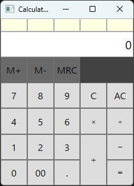

電卓アプリケーション
===============

## 概要
WPF(Windows Media Foundation)を用いた電卓アプリです。

## 使用環境

使用環境は下記のとおりです。

 * Windows 11
 * Microsoft Visual Studio Community 2022 (64 ビット), Version Version 17.8.6
 * .NET 8.0
 * WPF

## 対応機能

 * 四則演算ボタン
 * 入力数値および計算結果の表示機能
 * 現在選択中の四則演算の表示機能
 * エラーステータスの表示機能(オーバーフロー, ゼロ除算)
 * A(Clear)機能
 * AC(All Clear)機能

## 未対応機能

 * M+ボタン機能
 * M-ボタン機能
 * MRCボタン機能

## 使い方

## 問題点
### 演算の精度について

## 設計詳細

### ソースファイル一覧

| ソースファイル名                | 概要                                                               |
| :-------------------------- | :---------------------------------------------------------------- |
| MainWindow.xaml.cs          | UI定義                                                             |
| CalculatorCore.cs           | 電卓機能を実現するコアクラス                                             |
| CalculatorState.cs          | 電卓の内部状態を表現するクラス(ステートパターンのベースクラス)                   |
| CalculatorInitState.cs      | 電卓の内部状態を表現するクラス(ステートパターンのサブクラス, 初期状態)             |
| CalculatorNum1State.cs      | 電卓の内部状態を表現するクラス(ステートパターンのサブクラス, 1個目の数値の入力中状態) |   
| CalculatorNum2State.cs      | 電卓の内部状態を表現するクラス(ステートパターンのサブクラス, 2個目の数値の入力中状態) |   
| CalculatorOperatorState.cs  | 電卓の内部状態を表現するクラス(ステートパターンのサブクラス, 演算子の入力中状態)     |   
| CalculatorErrorState.cs     | 電卓の内部状態を表現するクラス(ステートパターンのサブクラス, エラー状態)           |
| CalculatorTokens.cs         | 電卓のボタンに対応するトークン定義(数値, 小数点, 演算子, イコール等)             |
| CalculatorValue.cs          | 電卓に入力された, または電卓で計算された数値を表すクラス                       |
| DigitFormatter.cs           | ディスプレイの桁表示用のフォーマッタクラス                                  |

