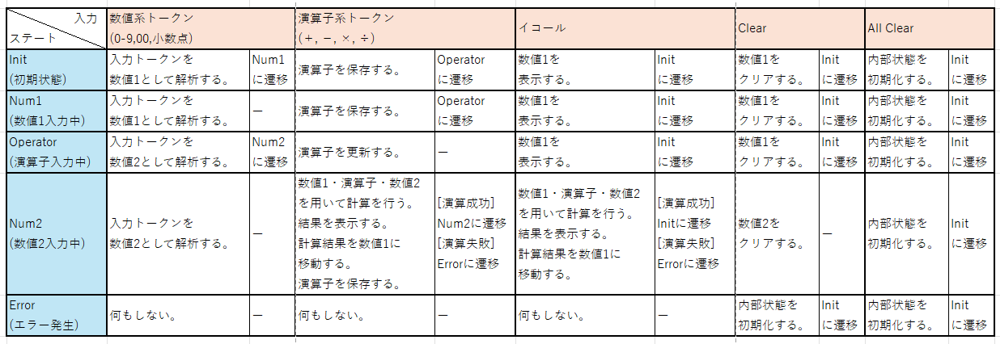

電卓アプリケーション
===============

## 概要
WPF(Windows Media Foundation)を用いた電卓アプリです。

## 使用環境

使用環境は下記のとおりです。

 * Windows 11
 * Microsoft Visual Studio Community 2022 (64 ビット), Version Version 17.8.6
 * .NET 8.0
 * WPF

## 対応機能

対応機能は下記の通りです.

 * 四則演算ボタン
 * 入力数値および計算結果の表示機能
 * 現在選択中の四則演算の表示機能
 * エラーステータスの表示機能(オーバーフロー, ゼロ除算)
 * A(Clear)機能
 * AC(All Clear)機能

## 未対応機能

現状の実装では, 下記の機能には未対応です.

 * M+ボタン機能(ボタンは配置してあるが, 動作しない)
 * M-ボタン機能(ボタンは配置してあるが, 動作しない)
 * MRCボタン機能(ボタンは配置してあるが, 動作しない)

## 使い方

使い方は下記の通りです.

 1. 下記のGitリポジトリをクローンして下さい.
    
 2. リポジトリ直下の**Calculator.sln**をオープンして下さい.

 3. T.B.D.

## 設計詳細

### ソースファイル一覧

ソースファイルは下記の通りです.

| ソースファイル名                | 概要                                                               |
| :-------------------------- | :---------------------------------------------------------------- |
| MainWindow.xaml.cs          | UI定義                                                             |
| CalculatorCore.cs           | 電卓機能を実現するコアクラス                                             |
| CalculatorState.cs          | 電卓の内部状態を表現するクラス(ステートパターンのベースクラス)                   |
| CalculatorInitState.cs      | 電卓の内部状態を表現するクラス(ステートパターンのサブクラス, 初期状態)             |
| CalculatorNum1State.cs      | 電卓の内部状態を表現するクラス(ステートパターンのサブクラス, 1個目の数値の入力中状態) |   
| CalculatorNum2State.cs      | 電卓の内部状態を表現するクラス(ステートパターンのサブクラス, 2個目の数値の入力中状態) |   
| CalculatorOperatorState.cs  | 電卓の内部状態を表現するクラス(ステートパターンのサブクラス, 演算子の入力中状態)     |   
| CalculatorErrorState.cs     | 電卓の内部状態を表現するクラス(ステートパターンのサブクラス, エラー状態)           |
| CalculatorTokens.cs         | 電卓のボタンに対応するトークン定義(数値, 小数点, 演算子, イコール等)             |
| CalculatorValue.cs          | 電卓に入力された, または電卓で計算された数値を表すクラス                       |
| DigitFormatter.cs           | ディスプレイの桁表示用のフォーマッタクラス                                  |

### 実装方針

実装としてはステートパターンを用いました.
理由は, 当初C言語でプロトタイプを作成したところ, 状態遷移系の処理で条件分岐が煩雑になったためです.

### クラス図

クラス図は下記の通りです.

### 状態遷移図

状態遷移は下記の通りです。

### 演算エラーについて

下記の場合に四則演算(＋, －, ×, ÷)時のエラーが発生する可能性があります.
エラーが発生した場合, 内部ステートマシンがエラー状態(Error)に遷移します.
Clear/All Clearボタンを押す事で初期状態(Init)に戻ります.

 * オーバーフロー
 * ゼロ除算
 * 演算結果の整数部分(負値の場合は符号も含める)が最大桁数を超えた.

### 演算結果の桁表示について

 * 演算結果の(符号を含んだ)整数部分の桁数が最大桁数を超えた場合はエラーとします.
 * そうでない場合, 演算結果が小数部分を持つ場合, 残りの桁数を可能な限り小数点と小数部分でフィルします.  
   残りの桁に入り切らなかった小数部分は切り捨てられます.
 * 整数部分をフィルした後, 残りの桁が1桁しかない場合は小数の表示は行いません.
   (小数点をフィルするだけになってしまうため)

### 演算の精度について

現時点で対応可能な実装では, 計算結果は最大桁数で打ち切られます.
例として, 1÷3を計算した場合, 理想的には計算結果は「0.333...」となりますが, 最大桁数の20桁「0.33_3333_3333_3333_3333」で打ち切られます.
今後の課題となります.

補足: 手持ちの電卓で確認したところ, 最大桁数で打ち切る動作になっているようでした. 製品によるのかもしれません.

## 現状の課題

